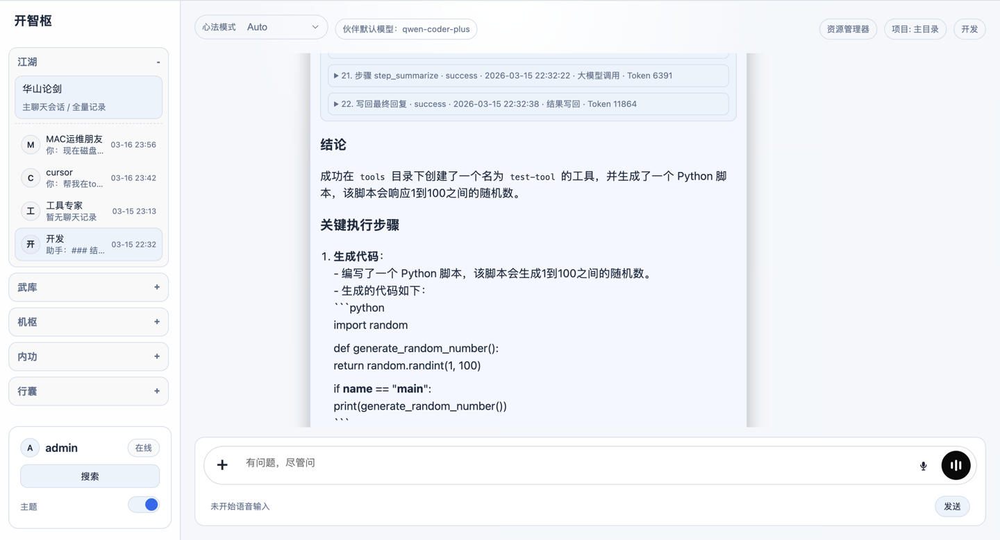

- 👋 Hi, I'm **Shunyao Yin** (@yinshunyao)
- 📫 Contact: **yinshunyao@qq.com**

## About Me

AI product engineer with hands-on experience in **Python full-stack development**, **AI agent platform engineering**, and **CV annotation system design**.  
I focus on turning complex AI workflows into stable, usable products with clear architecture and efficient delivery.

## Core Technical Strengths

- **Python engineering**: Django / FastAPI / Flask / gRPC, API design, service orchestration, and automation tooling
- **AI application integration**: LLM integration (Qwen), agent execution flow design, tool calling and capability abstraction
- **Data & annotation systems**: multi-source data ingestion, template-based annotation workflow, 3D annotation scenario support
- **CV/ML engineering foundation**: PyTorch / TensorFlow / OpenCV / NumPy with product-oriented implementation mindset
- **Delivery & maintainability**: modular architecture, environment bootstrap scripts, reproducible local deployment, and operation-friendly design

## Project Highlights

### 1) Codiiy - Local AI Automation Assistant Platform

- Designed and implemented a layered architecture: **Web UI ↔ Django service ↔ AI agent engine ↔ capability components**
- Built practical automation capabilities around local workflows, including file retrieval/operations and messaging notifications
- Integrated LLM (Qwen) into a controllable agent runtime to support conversational task execution
- Improved developer onboarding and reliability with one-command setup/startup flow and standardized runtime conventions

### 2) AI Annotation Product - Data Access & Annotation Efficiency

- Delivered **multi-source data access** in one entry point (local upload, HTTP incremental pull, MinIO/SFTP/FTP, etc.)

- Added **data preview before source creation** to reduce wrong-data ingestion risk and improve data preparation quality

- Enabled **intelligent code generation for annotation templates**, significantly reducing configuration cost for complex tasks

- Supported **3D point-cloud cuboid annotation** workflows, expanding product capability to advanced spatial scenarios

## Collaboration Focus

- Open to collaborations on **AI products**, **Web backend systems**, and **CV data/annotation platforms**
- Strong preference for projects that require both **engineering depth** and **product delivery speed**

<!---
yinshunyao/yinshunyao is a ✨ special ✨ repository because its `README.md` (this file) appears on your GitHub profile.
You can click the Preview link to take a look at your changes.
--->
