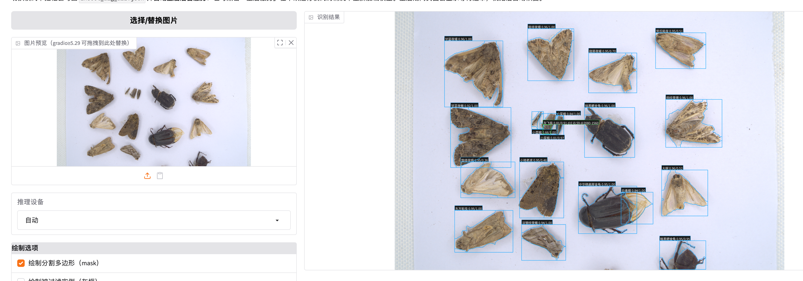

- 👋 Hi, I'm **Shunyao Yin** (@yinshunyao)
- 📫 Contact: **wecht: 17302868369**

## About Me

AI product engineer with hands-on experience in **Python full-stack development**, **AI agent platform engineering**, **CV annotation system design**, and **end-to-end agricultural CV delivery** (data prep → train → deploy → serve).  
I focus on turning complex AI workflows into stable, usable products with clear architecture and efficient delivery — especially **config-driven multi-model inference** for real field devices.

## Core Technical Strengths

- **Python engineering**: Django / FastAPI / Flask / gRPC, API design, service orchestration, and automation tooling
- **AI application integration**: LLM integration (Qwen), agent execution flow design, tool calling and capability abstraction
- **Data & annotation systems**: multi-source data ingestion, template-based annotation workflow, 3D annotation scenario support
- **CV/ML engineering**: PyTorch / OpenCV / NumPy; YOLO detect·segment·cls, RT-DETR, ConvNeXt / timm, ArcFace; VOC/YOLO data pipelines and hard-case augmentation
- **CV inference & deployment**: config-driven multi-root pipelines; **YOLO / ONNX Runtime / TensorRT** backends; per-class confidence & diagonal-size (`dia`) filters; relative-size rerank; Gradio + FastAPI serving
- **Delivery & maintainability**: modular architecture, environment bootstrap scripts, reproducible local deployment, and operation-friendly design

## Project Highlights

### 1) Codiiy - Local AI Automation Assistant Platform

- Designed and implemented a layered architecture: **Web UI ↔ Django service ↔ AI agent engine ↔ capability components**
- Built practical automation capabilities around local workflows, including file retrieval/operations and messaging notifications
- Integrated LLM (Qwen) into a controllable agent runtime to support conversational task execution
- Improved developer onboarding and reliability with one-command setup/startup flow and standardized runtime conventions

### 2) AI Annotation Product - Data Access & Annotation Efficiency

- Delivered **multi-source data access** in one entry point (local upload, HTTP incremental pull, MinIO/SFTP/FTP, etc.)

- Added **data preview before source creation** to reduce wrong-data ingestion risk and improve data preparation quality

- Enabled **intelligent code generation for annotation templates**, significantly reducing configuration cost for complex tasks

- Supported **3D point-cloud cuboid annotation** workflows, expanding product capability to advanced spatial scenarios

### 3) Insect Pest Recognition - Train-to-Serve CV Platform

End-to-end pest identification for **sticky-trap field devices, lab evaluation, and production APIs** — covering data augmentation, multi-framework training, config-driven inference, and online delivery.  
Open inference reference: [yinshunyao/script](https://github.com/yinshunyao/script).

**Training & data**

- Built a field-oriented train suite: detect-for-localize → classify-for-species (avoids near-species collisions on one detect head)
- Covered rare / stacked / occluded insects via transparent-bug augmentation, background paste, and per-class sampling quotas
- Unified VOC/YOLO multi-source merge; YOLO / RetinaNet / RT-DETR detection and YOLO-cls / ConvNeXt / DINOv3 / ArcFace classification entries

**Inference & filtering (JSON-configurable)**

- **Multi-backend detect**: Ultralytics YOLO (`.pt`), TensorRT (`.engine`), ONNX Runtime (`.onnx`) on the same `PredictSize` pipeline; YOLO segment + nested YOLO-cls / timm ConvNeXt
- **Config-driven routing**: recursive `out` → `models.cls` decision tree (class / regex / diagonal-size interval keys); lab / field / custom profiles via `run_model` without code changes
- **Confidence & size gates**: root + per-class `detect_conf` / `cls_conf`, large/small body-size floors, pixel or mm diagonal (`dia` / `dia_mm`), and **same-image relative-size rerank** when top-1 scale mismatches peers
- **Geometry & morphology**: same-class IoU merge, big/small IoR nesting filters, `mask_rate`, dark-ratio, sticky-trap ROI, multi-scale sliding windows, in-big small-insect recovery
- **Explainable rejects**: `filter_reason` on dropped instances (threshold / cls / dia / relative_size / geometry / …)

**Serving & quality loop**

- Gradio test UI + FastAPI REST (`/insect_3_predict`), health checks, warmup, hot profile switching, TensorRT / batch / multi-process pools for GPU throughput
- Built-in Pascal VOC validation, incremental batch resume, Label Studio hard-case export, and offline det/cls threshold grid search

## Collaboration Focus

- Open to collaborations on **AI products**, **Web backend systems**, **CV data/annotation platforms**, **agricultural / insect CV**, and **CV inference / MLOps delivery**
- Strong preference for projects that require both **engineering depth** and **product delivery speed**

<!---
yinshunyao/yinshunyao is a ✨ special ✨ repository because its `README.md` (this file) appears on your GitHub profile.
You can click the Preview link to take a look at your changes.
--->
