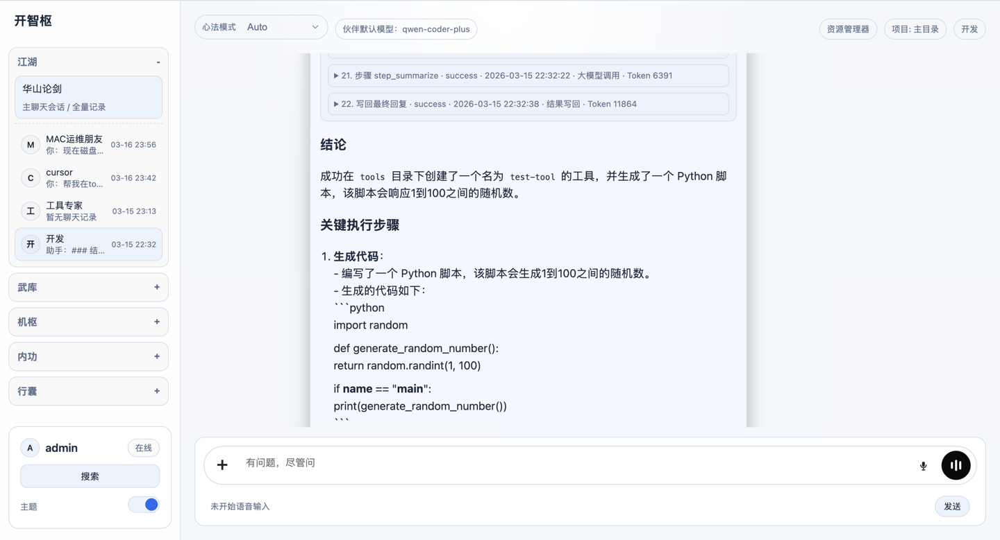

- 👋 Hi, I'm **Shunyao Yin** (@yinshunyao)
- 📫 Contact: **wecht: 17302868369**

## About Me

AI product engineer with hands-on experience in **Python full-stack development**, **AI agent platform engineering**, **CV annotation system design**, and **CV inference platform delivery**.  
I focus on turning complex AI workflows into stable, usable products with clear architecture and efficient delivery.

## Core Technical Strengths

- **Python engineering**: Django / FastAPI / Flask / gRPC, API design, service orchestration, and automation tooling
- **AI application integration**: LLM integration (Qwen), agent execution flow design, tool calling and capability abstraction
- **Data & annotation systems**: multi-source data ingestion, template-based annotation workflow, 3D annotation scenario support
- **CV/ML engineering foundation**: PyTorch / TensorFlow / OpenCV / NumPy with product-oriented implementation mindset
- **CV inference & deployment**: config-driven multi-model pipelines, YOLO detect/segment/cls, TensorRT, Gradio/FastAPI serving
- **Delivery & maintainability**: modular architecture, environment bootstrap scripts, reproducible local deployment, and operation-friendly design

## Project Highlights

### 1) Codiiy - Local AI Automation Assistant Platform

- Designed and implemented a layered architecture: **Web UI ↔ Django service ↔ AI agent engine ↔ capability components**
- Built practical automation capabilities around local workflows, including file retrieval/operations and messaging notifications
- Integrated LLM (Qwen) into a controllable agent runtime to support conversational task execution
- Improved developer onboarding and reliability with one-command setup/startup flow and standardized runtime conventions

### 2) AI Annotation Product - Data Access & Annotation Efficiency

- Delivered **multi-source data access** in one entry point (local upload, HTTP incremental pull, MinIO/SFTP/FTP, etc.)

- Added **data preview before source creation** to reduce wrong-data ingestion risk and improve data preparation quality

- Enabled **intelligent code generation for annotation templates**, significantly reducing configuration cost for complex tasks

- Supported **3D point-cloud cuboid annotation** workflows, expanding product capability to advanced spatial scenarios

### 3) Insect Pest Recognition - Unified CV Inference Platform

End-to-end pest identification system for **field devices, lab evaluation, and production deployment** — from model orchestration to online API delivery.

- Built a **config-driven unified inference pipeline** (`predict_all`): multi-root detect / segment / nested classification in one runtime, with JSON-only routing for new species and scenario profiles (field / lab / custom)
- Designed **recursive `out` → `models.cls` routing** so algorithm changes ship without code edits; detect and segment roots run in parallel with unified bbox + polygon output
- Delivered **production-ready serving** via Gradio test UI + FastAPI REST (`/insect_3_predict`), health checks, model warmup, hot profile switching, and backward-compatible API responses
- Optimized **GPU throughput** with TensorRT, tiled detect/seg batching, GPU crop pipelines, and optional multi-process worker pools for concurrent HTTP traffic
- Implemented **field-adaptive logic**: sticky-trap ROI preprocessing, multi-scale sliding windows, in-big small-insect recovery, and JSON-tunable size/morphology filters for on-site tuning
- Closed the **quality loop** with built-in Pascal VOC validation (TP/FP/FN metrics), explainable filter reasons, incremental batch resume, and Label Studio hard-case export

## Collaboration Focus

- Open to collaborations on **AI products**, **Web backend systems**, **CV data/annotation platforms**, and **CV inference / MLOps delivery**
- Strong preference for projects that require both **engineering depth** and **product delivery speed**

<!---
yinshunyao/yinshunyao is a ✨ special ✨ repository because its `README.md` (this file) appears on your GitHub profile.
You can click the Preview link to take a look at your changes.
--->
